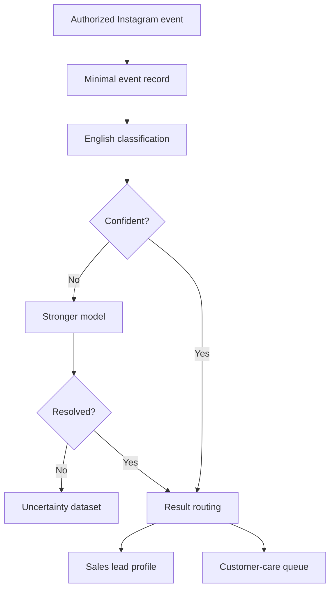

# Instagram Beauty Lead Intelligence Pipeline

A privacy-aware AI pipeline that helps beauty and skincare businesses identify qualified sales opportunities and customer-care cases from authorized Instagram interactions.

> **Project status:** Milestone 1 — repository security and project foundation The current code is an early prototype and does not yet implement the complete MVP described in the product specification.

## The problem

Beauty and skincare businesses may receive many Instagram comments containing:

- Product questions
- Purchase intent
- Requests for recommendations
- Price or availability questions
- Customer complaints
- Irrelevant content or spam

Reviewing these interactions manually is time-consuming, and valuable sales opportunities can be missed.

## The proposed solution

The MVP will receive new comments and supported mentions from one client-authorized Instagram Business account through Meta’s official API.

It will:

1. Validate and minimally store authorized interactions.
2. Classify every new English comment.
3. Separate sales opportunities from customer-care cases.
4. Re-evaluate uncertain results with a stronger model.
5. Retrieve relevant context from the client’s product catalogue.
6. Build one evolving, client-scoped lead profile per Instagram user.
7. Preserve evidence, confidence, and model-version information.
8. Apply retention, tenant-isolation, and verified-erasure rules.

The MVP will **not** automatically reply to or contact Instagram users.

## Classification outcomes

Each eligible interaction receives one top-level classification:

| Classification | Meaning |
|---|---|
| `SALES_LEAD` | A sufficiently confident buying opportunity |
| `CUSTOMER_CARE` | A complaint, dissatisfaction, or product problem |
| `IRRELEVANT` | Content unrelated to the business purpose |
| `SPAM` | Unwanted or deceptive content |
| `UNCERTAIN` | Insufficient confidence for automatic promotion |

Uncertain results are never forced into the validated lead database.

## Product principles

- **Authorized access only:** no scraping or scanning unrelated public accounts.
- **Precision first:** the initial target is at least 90% precision for promoted sales leads.
- **Data minimization:** store only information required for classification and traceability.
- **Beauty-relevant profiles only:** no unrelated personal-profile enrichment.
- **No medical inference:** record only skin concerns explicitly stated by the user.
- **Explainable interests:** preserve evidence, confidence, inference type, and model version.
- **Client isolation:** never combine or share user information across businesses.
- **No automatic outreach:** the MVP performs intelligence and routing only.

## High-level workflow



The client’s catalogue supplies relevant product context through retrieval-augmented generation (RAG). The classifier—not the retrieval component—makes the final classification decision.

## MVP boundaries

### In scope

- One consenting beauty or skincare pilot business
- One authorized Instagram Business account
- New English comments after account connection
- Comments on posts and reels
- Supported account mentions
- Sales-lead and customer-care classification
- Catalogue-grounded interest detection
- Two-stage uncertainty handling
- Client-scoped lead profiles
- Retention and verified erasure

### Out of scope

- Scraping public profiles, competitors, or hashtags
- Historical comment imports
- Personal or Creator accounts
- Non-English classification
- Direct-message processing
- Automatic replies or outreach
- Medical diagnosis or advice
- Cross-client enrichment
- Customer-facing dashboards or CRM integrations

## Repository structure

```text
ai-assisted/
├── docs/
│   └── milestone-0-mvp-scope-and-acceptance-criteria.md
├── pipelines/
│   ├── data/
│   ├── src/
│   ├── init_db.py
│   ├── render.yaml
│   └── requirements.txt
├── .env.example
├── .gitignore
└── README.md
```

The files under `pipelines/` represent the early prototype and will be reorganized during later milestones.

## Configuration

Copy the environment template and replace its placeholders locally:

```bash
cp .env.example .env
```

Required variables:

| Variable | Purpose |
|---|---|
| `META_APP_SECRET` | Validates signed Meta webhook requests |
| `WEBHOOK_VERIFY_TOKEN` | Verifies the webhook callback |
| `IG_BUSINESS_ACCOUNT_ID` | Identifies the authorized pilot account |
| `DB_PATH` | Sets the local database path |
| `PORT` | Sets the application port |

Never commit the local `.env` file or real credentials.

## Current implementation status

- [x] Milestone 0: MVP scope and acceptance criteria
- [x] Repository secret and generated-file cleanup
- [x] Environment configuration template
- [x] Root project documentation
- [x] Python project and quality-tool configuration
- [x] Automated baseline tests
- [x] Continuous integration
- [x] Clean application architecture
- [x] Tenant-aware persistence model
- [ ] Authorized Meta webhook ingestion
- [ ] Classification and uncertainty pipeline
- [ ] Catalogue-grounded retrieval
- [ ] Evaluation against the 90% precision target
- [ ] Retention and erasure automation
- [ ] Controlled pilot validation

## Source of truth

The complete approved product scope, all 35 product decisions, and the measurable MVP acceptance criteria are documented in:

[`docs/milestone-0-mvp-scope-and-acceptance-criteria.md`](docs/milestone-0-mvp-scope-and-acceptance-criteria.md)

Any change to the approved product boundary must be recorded as a dated decision amendment before implementation.