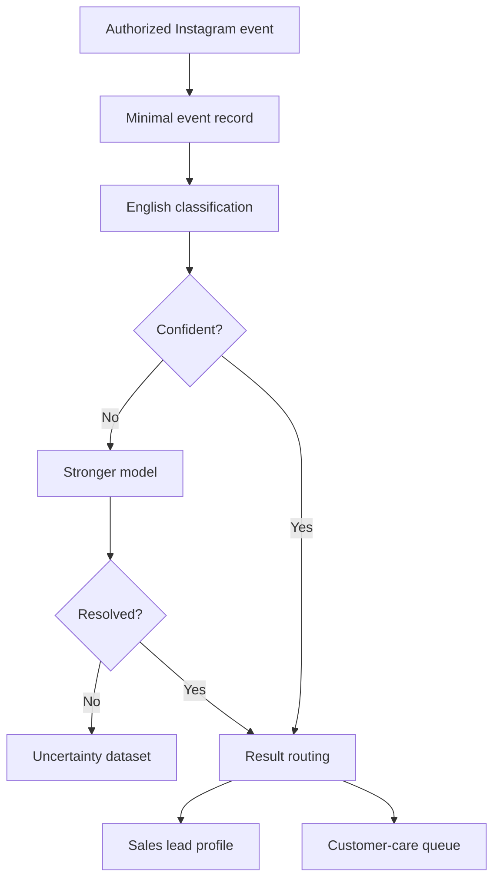

# Lead Intelligence Pipeline

A privacy-aware AI pipeline for turning authorized customer interactions into structured lead intelligence, qualification signals, and customer-care routing.

The system is designed to help businesses identify which incoming interactions may represent real sales opportunities, which require customer support, and which are uncertain enough to need stronger model review.

Rather than treating every interaction equally, the pipeline combines structured classification, catalogue-grounded context, business rules, validation, persistence, and uncertainty handling to create a more useful downstream sales workflow.

## Business Problem

Businesses can receive large volumes of customer interactions across social and digital channels, but those interactions do not all have the same commercial value or urgency.

Without a structured qualification process:

- high-intent leads may be missed or followed up too late;
- support requests may be mixed with sales opportunities;
- teams may spend time reviewing low-value interactions manually;
- uncertain cases may be classified too confidently;
- customer context and product interest may remain fragmented across systems.

The Lead Intelligence Pipeline is designed to reduce that ambiguity by converting raw interactions into structured, reviewable business signals.

## Current Scope

The current MVP focuses on authorized Instagram Business interactions and public or client-provided business information.

The pipeline includes:

- interaction ingestion
- validation and normalization
- lead and customer-care classification
- interest extraction
- stronger-model escalation for uncertain cases
- catalogue-grounded product or service context
- structured persistence
- tenant-aware data handling
- retention and erasure foundations
- automated tests and static checks

The system is intentionally designed around explicit privacy and access boundaries. It does not rely on private-profile scraping, unauthorized messaging, or unrestricted personal-data collection.

## Intended Outcome

The goal is to help a business move from:

`raw interaction → manual review → inconsistent follow-up`

toward:

`validated interaction → structured intent → lead priority → appropriate business action`

This allows sales and customer-care teams to spend more time on the interactions that actually require attention.


## MVP Workflow

The MVP processes new comments and supported mentions from one client-authorized Instagram Business account through Meta's official API.

It will:

1. Validate and minimally store authorized interactions.
2. Classify every new English comment.
3. Separate sales opportunities from customer-care cases.
4. Re-evaluate uncertain results with a stronger model.
5. Retrieve relevant context from the client’s product catalogue.
6. Build one evolving, client-scoped lead profile per Instagram user.
7. Preserve evidence, confidence, and model-version information.
8. Apply retention, tenant-isolation, and verified-erasure rules.

The MVP will **not** automatically reply to or contact Instagram users.

## Classification outcomes

Each eligible interaction receives one top-level classification:

| Classification | Meaning |
|---|---|
| `SALES_LEAD` | A sufficiently confident buying opportunity |
| `CUSTOMER_CARE` | A complaint, dissatisfaction, or product problem |
| `IRRELEVANT` | Content unrelated to the business purpose |
| `SPAM` | Unwanted or deceptive content |
| `UNCERTAIN` | Insufficient confidence for automatic promotion |

Uncertain results are never forced into the validated lead database.

## Product principles

- **Authorized access only:** no scraping or scanning unrelated public accounts.
- **Precision first:** the initial target is at least 90% precision for promoted sales leads.
- **Data minimization:** store only information required for classification and traceability.
- **Beauty-relevant profiles only:** no unrelated personal-profile enrichment.
- **No medical inference:** record only skin concerns explicitly stated by the user.
- **Explainable interests:** preserve evidence, confidence, inference type, and model version.
- **Client isolation:** never combine or share user information across businesses.
- **No automatic outreach:** the MVP performs intelligence and routing only.

## High-level workflow



The client’s catalogue supplies relevant product context through retrieval-augmented generation (RAG). The classifier—not the retrieval component—makes the final classification decision.

## MVP boundaries

### In scope

- One consenting beauty or skincare pilot business
- One authorized Instagram Business account
- New English comments after account connection
- Comments on posts and reels
- Supported account mentions
- Sales-lead and customer-care classification
- Catalogue-grounded interest detection
- Two-stage uncertainty handling
- Client-scoped lead profiles
- Retention and verified erasure

### Out of scope

- Scraping public profiles, competitors, or hashtags
- Historical comment imports
- Personal or Creator accounts
- Non-English classification
- Direct-message processing
- Automatic replies or outreach
- Medical diagnosis or advice
- Cross-client enrichment
- Customer-facing dashboards or CRM integrations

## Repository structure

```text
ai-assisted/
├── docs/
│   └── milestone-0-mvp-scope-and-acceptance-criteria.md
├── pipelines/
│   ├── data/
│   ├── src/
│   ├── init_db.py
│   ├── render.yaml
│   └── requirements.txt
├── .env.example
├── .gitignore
└── README.md
```

## Configuration

Copy the environment template and replace its placeholders locally:

```bash
cp .env.example .env
```

Required variables:

| Variable | Purpose |
|---|---|
| `META_APP_SECRET` | Validates signed Meta webhook requests |
| `WEBHOOK_VERIFY_TOKEN` | Verifies the webhook callback |
| `IG_BUSINESS_ACCOUNT_ID` | Identifies the authorized pilot account |
| `MAX_WEBHOOK_PAYLOAD_BYTES` | Limits accepted webhook request bodies; defaults to 1 MiB |
| `DB_PATH` | Sets the local database path |
| `PORT` | Sets the application port |
| `ANTHROPIC_API_KEY` | Authenticates Anthropic classification requests |
| `PRIMARY_CLASSIFIER_MODEL` | Selects the economical primary classifier; defaults to Claude Haiku 4.5 |
| `STRONGER_CLASSIFIER_MODEL` | Selects the stronger uncertainty classifier; defaults to Claude Sonnet 5 |
| `CLASSIFICATION_PROMPT_VERSION` | Identifies the classification prompt version stored with results |
| `CLASSIFICATION_MAX_TOKENS` | Limits generated tokens per classification; defaults to 256 |

Never commit the local `.env` file or real credentials.

## Classify one persisted interaction

After installing the project, applying migrations, and exporting the required
database and Anthropic environment variables, classify one interaction by its
stable event ID:

```bash
lead-pipeline-classify example-event-id
```

The command loads the minimized interaction, executes primary classification,
escalates explicit uncertainty when necessary, and persists the outcome through
the retry-safe lifecycle.

It prints only privacy-safe outcome metadata:

```json
{
  "is_unresolved": false,
  "label": "SALES_LEAD",
  "status": "COMPLETED",
  "was_escalated": false
}
```

Comment text, username, and event ID are not printed.


## Current implementation status

- [x] Milestone 0: MVP scope and acceptance criteria
- [x] Repository secret and generated-file cleanup
- [x] Environment configuration template
- [x] Root project documentation
- [x] Python project and quality-tool configuration
- [x] Automated baseline tests
- [x] Continuous integration
- [x] Clean application architecture
- [x] Tenant-aware persistence model
- [x] Authorized Meta webhook ingestion
- [x] Classification and uncertainty pipeline
- [x] Catalogue-grounded retrieval
- [ ] Evaluation against the 90% precision target
- [ ] Retention and erasure automation
- [ ] Controlled pilot validation

## Source of truth

The complete approved product scope, all 35 product decisions, and the measurable MVP acceptance criteria are documented in:

[`docs/milestone-0-mvp-scope-and-acceptance-criteria.md`](docs/milestone-0-mvp-scope-and-acceptance-criteria.md)

Any change to the approved product boundary must be recorded as a dated decision amendment before implementation.