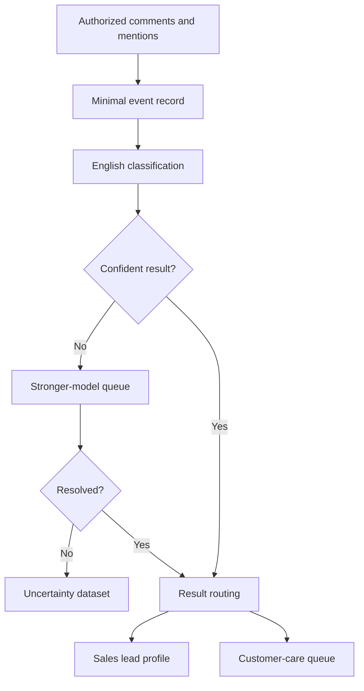

# Milestone 0: MVP Scope and Acceptance Criteria

**Project:** Instagram Beauty and Skincare Lead Intelligence Pipeline  
**Status:** Approved product baseline  
**Decision date:** 2026-08-01  
**Applies to:** First customer pilot  

## 1. Purpose

This document is the source of truth for the MVP product boundary. It consolidates
the 35 decisions made during Milestone 0 and defines the conditions that must be
met before the MVP can be accepted for a controlled pilot.

The MVP receives new Instagram interactions belonging to one authorized beauty
or skincare business, classifies them without sending messages, and stores
qualified sales interests or customer-care cases in isolated, privacy-aware
records.

## 2. Product statement

> For an Instagram Business account that sells beauty and skincare products,
> the MVP captures new authorized comments and mentions, identifies sales leads
> and customer-care opportunities, enriches results with the business's product
> catalogue, and preserves explainable evidence without automatically contacting
> Instagram users.

## 3. Product boundary

### 3.1 In scope

- One real pilot business that sells beauty or skincare products.
- One client-authorized Instagram Business account.
- New English-language interactions received after account connection.
- Comments on the client's posts and reels.
- Notifications when the client account is mentioned, where supported by the
  authorized Meta webhook integration.
- Classification of every new English comment as:
  - `SALES_LEAD`
  - `CUSTOMER_CARE`
  - `IRRELEVANT`
  - `SPAM`
  - `UNCERTAIN`
- Detection of beauty-relevant interests and explicitly stated skin concerns.
- Catalogue-grounded product context using retrieval-augmented generation (RAG).
- Automatic escalation of uncertain classifications and interests to a stronger
  model.
- Separate storage for sales leads, customer-care cases, and unresolved items.
- One evolving lead profile per Instagram user within the pilot client's data
  boundary.
- Retention, verified erasure, and tenant-isolation rules defined in this
  document.

### 3.2 Out of scope

- Scanning arbitrary public Instagram accounts, competitors, hashtags, or all
  beauty pages.
- Importing comments created before the client account was connected.
- Personal or Creator Instagram accounts.
- Non-English classification.
- Direct messages unless they are added through a later scope decision.
- Automatic replies, outreach, ordering, or sales actions.
- Runtime human review as part of the normal classification workflow.
- Scraping profile pages or collecting birthdays, relationships, education, or
  unrelated biography data.
- Inferring medical conditions, diagnosing skin conditions, or giving medical
  advice.
- Combining or sharing a person's information across client businesses.
- A customer-facing dashboard, CRM integration, or recommendation delivery in
  this milestone.

## 4. Actors and responsibilities

| Actor | Responsibility |
|---|---|
| Pilot client | Owns and authorizes the Instagram Business account; supplies its product catalogue; receives and verifies erasure requests |
| Platform | Receives authorized events, classifies comments, stores isolated records, enforces retention, and executes verified erasure |
| Instagram user | Creates the source interaction and may ask the client to erase associated information |
| Meta | Provides authorization, API access, and webhook notifications subject to its platform rules |

## 5. MVP information flow

RAG retrieves relevant catalogue items, categories, and descriptions as context
for the classifier. RAG does not itself decide the final class.

## 6. Classification and routing rules

### 6.1 Sales lead

A `SALES_LEAD` shows a beauty- or skincare-related buying opportunity, including
price, availability, product suitability, recommendation, or ordering intent.

Qualified sales interactions update one lead profile identified by the stable
Instagram user/account ID. A username is display metadata and may change.
Multiple relevant comments become evidence attached to the same profile rather
than separate lead identities.

### 6.2 Customer care

A `CUSTOMER_CARE` result represents a complaint, dissatisfaction, or product
problem. It is stored in a customer-care queue separate from sales leads.

If the same person has both sales interest and a complaint, the two records stay
separate but link to the same client-scoped user profile.

### 6.3 Uncertainty

The primary classifier records its class, confidence, reason, and model version.
An uncertain classification enters a dedicated queue and is automatically
re-evaluated by a stronger model.

If the stronger model remains uncertain, the record remains `UNCERTAIN` and is
not promoted into either the sales-lead database or the customer-care queue. The
system must never force a final category merely to avoid uncertainty.

There is no runtime human-review step in the MVP. Human-created ground truth may
still be used offline to build the labeled evaluation dataset and measure model
quality; this is testing, not production routing.

## 7. Interest and recommendation data

The system may store only beauty-relevant information:

- Explicit product interests.
- Reasonably inferred product interests, labeled separately from explicit ones.
- Skin concerns explicitly stated by the Instagram user.
- Preferences and budget signals expressed in source interactions.
- Interaction history within the same client account.

Every interest must retain:

- Its supporting source comment.
- Whether it was explicit or inferred.
- A confidence score.
- The deciding model and model/prompt version.
- Relevant catalogue evidence when RAG was used.

Low-confidence inferred interests enter the stronger-model queue. They are added
to the confirmed profile only after reaching the configured confidence standard.
If they remain uncertain, they stay outside the confirmed profile.

The model must not infer medical diagnoses. It may record text such as "my skin
feels dry" as an explicitly stated concern, but it must not transform that text
into an unsupported medical condition.

## 8. Minimum data contract

### 8.1 Permitted event data

For each interaction, store only the fields needed for identity, traceability,
classification, and retention:

- Instagram comment/event ID.
- Comment text.
- Source timestamp and collection timestamp.
- Instagram user/account ID.
- Current username, when supplied by the authorized event or API.
- Client Instagram Business account ID.
- Media ID for the post or reel.
- Source type: post/reel comment or mention.
- Processing and retention metadata.

The stable Instagram comment/event ID is the idempotency key. A hash of username,
media ID, and text is not a valid replacement because two legitimate comments
can contain identical text.

### 8.2 Prohibited event data

- Complete webhook payloads retained as normal application data.
- Profile data obtained by scraping.
- Birthdays, relationship status, education, or unrelated biography details.
- Inferred medical conditions.
- Data copied from another client's account or profile space.

Temporary in-memory use of a signed webhook body for verification and parsing is
allowed; retaining the entire body is not.

## 9. Isolation, retention, and erasure

### 9.1 Client isolation

All user profiles, evidence, catalogue context, model outputs, and cases are
scoped to one client. If the same Instagram user interacts with two clients, the
system creates two independent profiles and does not join or share them.

### 9.2 Retention

| Record | Retention rule |
|---|---|
| Raw comment not supporting a validated lead | Delete or irreversibly anonymize after 90 days |
| Validated lead profile | Retain for up to 12 months |
| Source comment supporting a validated lead or confirmed interest | Retain with that lead for up to 12 months as evidence |
| Customer-care and unresolved records | Must receive an explicit retention category during schema design; may not be kept indefinitely |

The current decisions explicitly define 90-day raw-comment retention and
12-month validated-lead/evidence retention. Before production deployment,
Milestone 11 must set a lawful, documented retention period for customer-care
and unresolved records; until then they must use a conservative maximum of 90
days.

### 9.3 Erasure

The client receives and verifies an Instagram user's erasure request. The
platform provides an operation that deletes or irreversibly anonymizes all
associated raw comments, lead records, interests, evidence, and customer-care
records within that client's boundary, unless a documented legal exception
requires limited retention.

Erasure must use stable platform identifiers where available and must be
auditable without preserving the erased personal data in logs.

## 10. Meta integration boundary

The pilot uses Meta's official authorized integration only. Meta documents that
Instagram webhooks can notify an app when people comment on media owned by app
users and when app users are mentioned. This does not authorize general public
comment discovery.

The implementation team must verify the current access path in the Meta App
Dashboard rather than hard-code assumptions from an older API version. For the
current Instagram Login path, the pilot checklist is:

- [ ] Create or select the Meta app used for the pilot.
- [ ] Configure Instagram API with Instagram Login for an Instagram professional
      account and restrict the product to Business accounts in application logic.
- [ ] Request the minimum current permissions required to identify the authorized
      business and receive/read its comment activity; expected candidates include
      `instagram_business_basic` and, where required by the chosen API operation,
      `instagram_business_manage_comments`.
- [ ] Configure and verify the webhook callback and verify token.
- [ ] Subscribe to and test real `comments` notifications.
- [ ] Subscribe to and test real mention notifications supported by the selected
      webhook/API path.
- [ ] Verify every incoming event belongs to the connected pilot account.
- [ ] Confirm access-token lifecycle, revocation behavior, and reconnect flow.
- [ ] Put the app into the mode required for real pilot events.
- [ ] Complete App Review/advanced-access requirements before onboarding a client
      who is not an app-role tester.
- [ ] Provide the privacy-policy and data-deletion information required by Meta.

If real mention notifications cannot be received through the approved pilot
access path, mentions remain part of the desired scope but the pilot cannot be
declared fully accepted until the limitation is documented and the product owner
approves a scope amendment.

Official references:

- [Instagram API with Instagram Login](https://developers.facebook.com/documentation/instagram-platform/instagram-api-with-instagram-login)
- [Set up Instagram webhooks](https://developers.facebook.com/documentation/instagram-platform/webhooks)
- [Instagram webhook reference](https://developers.facebook.com/docs/graph-api/webhooks/reference/instagram/)
- [Meta permissions reference](https://developers.facebook.com/docs/permissions/)

## 11. Acceptance criteria

Milestone 0 defines the criteria; later milestones implement and prove them.
Unless an item explicitly says otherwise, acceptance requires an automated test
or reproducible pilot record, not only a visual inspection.

### 11.1 Scope and authorization

| ID | Criterion |
|---|---|
| AC-S01 | Only a client-authorized Instagram Business account can be connected. |
| AC-S02 | The pilot receives only new events created after successful connection; historical import is absent. |
| AC-S03 | A test comment on a pilot-owned post and reel is received through the official integration. |
| AC-S04 | A supported mention test is received and correctly labeled as a mention. |
| AC-S05 | An event for any account other than the connected client is rejected or safely ignored. |
| AC-S06 | No feature scans arbitrary public accounts, competitor pages, hashtags, or unrelated comments. |

### 11.2 Ingestion and data minimization

| ID | Criterion |
|---|---|
| AC-D01 | Each accepted interaction stores the minimum fields listed in Section 8.1. |
| AC-D02 | Duplicate delivery of the same Instagram comment/event ID creates no duplicate interaction. |
| AC-D03 | Two different Instagram comment IDs with identical user, media, and text are preserved as distinct interactions. |
| AC-D04 | The complete webhook payload is absent from durable application storage. |
| AC-D05 | No prohibited personal/profile field in Section 8.2 exists in the application data model. |
| AC-D06 | Username changes do not create a new identity when the stable Instagram user/account ID is unchanged. |

### 11.3 Classification and uncertainty

| ID | Criterion |
|---|---|
| AC-C01 | Every new English comment enters classification without keyword pre-filtering. |
| AC-C02 | The only top-level outcomes are `SALES_LEAD`, `CUSTOMER_CARE`, `IRRELEVANT`, `SPAM`, and `UNCERTAIN`. |
| AC-C03 | Promoted `SALES_LEAD` results achieve at least 90% precision on a versioned, representative labeled evaluation set. Precision is `true positives / all promoted sales leads`. |
| AC-C04 | The evaluation report states dataset size, class distribution, labeling method, model/prompt versions, threshold, and confidence interval or raw numerator/denominator. |
| AC-C05 | Precision has priority over recall; no minimum recall claim is made in the MVP. Recall is still reported to expose missed opportunities. |
| AC-C06 | A primary-model uncertainty is automatically routed to the stronger-model queue. |
| AC-C07 | A record unresolved by the stronger model stays `UNCERTAIN` and is not promoted. |
| AC-C08 | Runtime classification has no required human-review step and never forces an uncertain item into a final class. |
| AC-C09 | Complaints enter the customer-care queue and never masquerade as sales leads. |

### 11.4 Catalogue grounding and interests

| ID | Criterion |
|---|---|
| AC-I01 | Classification can retrieve context from the pilot client's own catalogue, categories, and descriptions. |
| AC-I02 | Catalogue records from another client cannot be retrieved for the pilot client. |
| AC-I03 | Each confirmed interest retains source evidence, explicit/inferred type, confidence, and model/prompt version. |
| AC-I04 | Low-confidence inferred interests are re-evaluated and remain outside the confirmed profile when unresolved. |
| AC-I05 | New interests update the same client-scoped lead profile while preserving earlier interests and evidence. |
| AC-I06 | Skin concerns are recorded only when explicitly stated; tests show that medical diagnoses are not inferred. |

### 11.5 Routing, isolation, and non-action

| ID | Criterion |
|---|---|
| AC-R01 | Multiple relevant comments from the same stable Instagram user ID create one lead profile per client. |
| AC-R02 | A user's sales lead and customer-care case remain separate and link to the same client-scoped profile. |
| AC-R03 | The same Instagram user interacting with two clients produces two isolated profiles with no cross-client enrichment. |
| AC-R04 | The MVP sends no reply, direct message, outreach, recommendation, or order action to an Instagram user. |

### 11.6 Retention and erasure

| ID | Criterion |
|---|---|
| AC-P01 | A scheduled retention process deletes or irreversibly anonymizes non-evidence raw comments after 90 days. |
| AC-P02 | Validated leads and their supporting evidence expire no later than 12 months unless erased earlier. |
| AC-P03 | A verified client-initiated erasure removes or irreversibly anonymizes all records linked to that user within the client boundary. |
| AC-P04 | An erasure in one client boundary does not expose or mutate another client's data. |
| AC-P05 | Logs and erasure audit records contain no erased comment text, username, or unnecessary personal identifiers. |

### 11.7 Pilot acceptance gate

The customer pilot may be called MVP-accepted only when:

1. All criteria `AC-S01` through `AC-P05` pass, except a criterion explicitly
   deferred by a written, product-owner-approved scope amendment.
2. The Meta checklist in Section 10 is completed with real pilot-account tests.
3. The 90% promoted-lead precision target is met on the documented evaluation
   set before results are presented as qualified leads.
4. No unresolved item is present in the validated-lead database.
5. No automatic user contact exists.

## 12. Current prototype gap register

This table records known conflicts discovered when this document was created. It
does not authorize implementation changes before their scheduled milestones.

| Gap | Current prototype | Required direction | Planned milestone |
|---|---|---|---:|
| Idempotency | Hashes username + media + text | Use Instagram comment/event ID | 3-4 |
| Payload retention | Stores `raw_payload` | Do not durably store full payload | 3-4 |
| User identity | No stable commenter ID | Stable Instagram user/account ID | 3 |
| Client isolation | Single account/schema assumption | Explicit tenant/client boundary | 2-3 |
| Classification | Tables only | Five classes plus two-stage uncertainty | 6-8 |
| Human review | `needs_review`/validation schema | No runtime human-review dependency | 7-9 scope revision |
| Lead model | One lead per raw comment | One evolving user profile with evidence | 3, 8 |
| Customer care | No separate queue | Separate linked customer-care cases | 3, 8 |
| Interests | Single product category | Versioned explicit/inferred interests | 3, 7-8 |
| Retention | Expiry field not enforced | 90-day/12-month automated policies | 11 |
| Erasure | Requests can be recorded only | Verified end-to-end erasure/anonymization | 11 |
| Action boundary | No reply today, undocumented | Enforce no automatic messages | 2, 7-10 |
| Meta access | One static account ID | Client authorization and ownership checks | 4 |

## 13. Decision traceability

| Decision | Approved result |
|---:|---|
| 1 | Client-authorized accounts |
| 2 | Beauty and skincare product businesses |
| 3 | Sales opportunities and complaints, classified separately |
| 4 | Posts, reels, and supported mentions |
| 5 | New interactions after connection only |
| 6 | Save for later classification; no automatic messages |
| 7 | Store the minimum necessary event data |
| 8 | Raw data: 90 days; promote only qualified lead information/interests |
| 9 | Validated leads: 12 months, subject to earlier erasure |
| 10 | Verified request erases/anonymizes all associated records |
| 11 | Client verifies requests; platform performs erasure |
| 12 | Instagram Business accounts only |
| 13 | One pilot account first |
| 14 | One consenting real beauty/skincare business for the pilot |
| 15 | English only |
| 16 | Classify every new English comment; no keyword gate |
| 17 | Preserve uncertain output and metadata for stronger-model processing |
| 18 | If still uncertain, retain outside validated data; do not force a class |
| 19 | Complaints use a separate customer-care queue |
| 20 | One lead profile per Instagram user, with combined interests/evidence |
| 21 | Sales and customer-care records remain separate but linked |
| 22 | Update profiles while preserving history |
| 23 | Stable Instagram user/account ID identifies the person; username may change |
| 24 | No unrelated profile enrichment; use only legitimate authorized data |
| 25 | Store beauty-relevant interests, concerns, preferences, budget signals, and history only |
| 26 | Record only explicitly stated skin concerns; never diagnose |
| 27 | Preserve explicit and reasonably inferred interests separately |
| 28 | Low-confidence interests stay outside the confirmed profile |
| 29 | Stronger model automatically re-evaluates uncertain interests |
| 30 | Preserve source, confidence, inference type, and model version |
| 31 | Validated-lead evidence: 12 months; other raw comments: 90 days |
| 32 | Isolate profiles and data per client; never combine across businesses |
| 33 | Ground classification in the client's catalogue using RAG context |
| 34 | Precision first; initial promoted-sales-lead target at least 90% |
| 35 | Pilot client completes Meta/Instagram Business authorization |

## 14. Milestone 0 completion rule

Milestone 0 is complete when this document is reviewed and approved as the
product baseline and the Meta checklist is recognized as a prerequisite for the
pilot, not as already-proven access.

Changes to an approved boundary must be added as a dated decision amendment.
Implementation begins with Milestone 1: repository security and hygiene.
